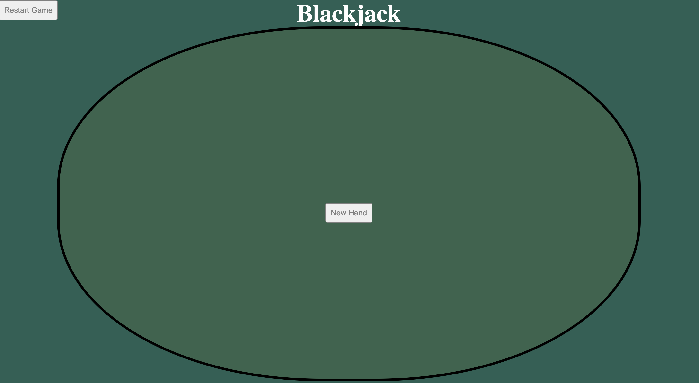
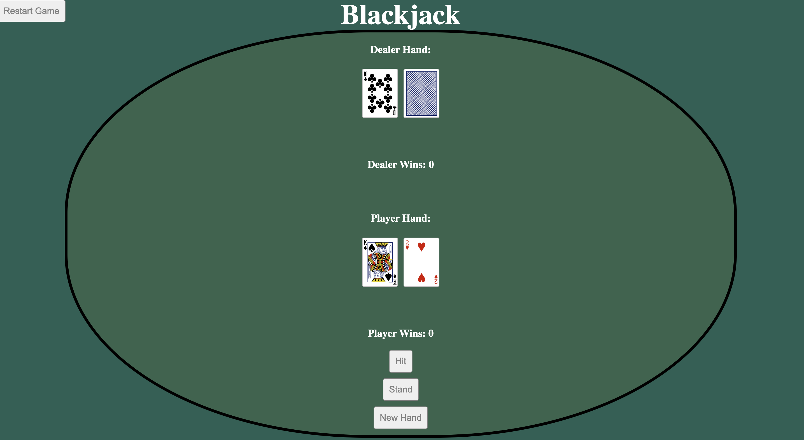
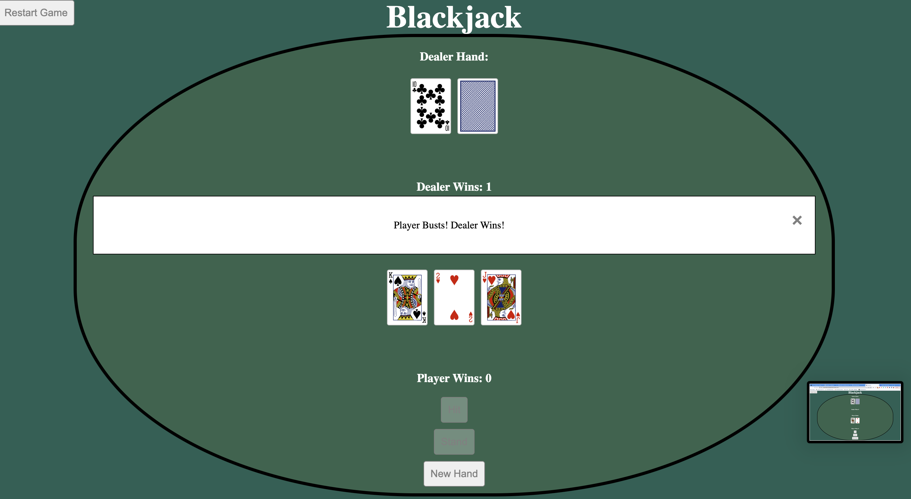
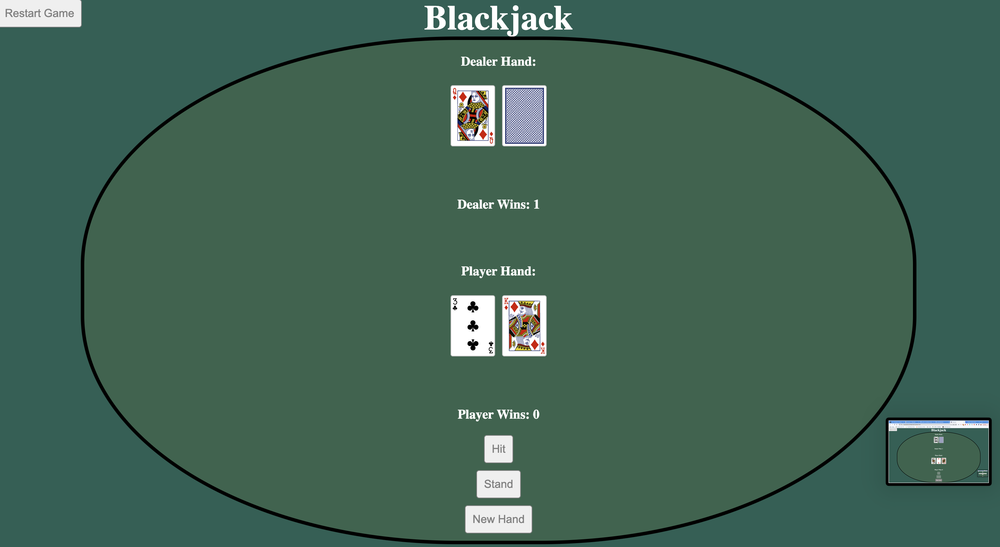

Game: Blackjack

Blackjack is the most played casino game in the world. The first reference to the game dates back all the way to the 1600s. The game utilizes a standard 52 card deck and puts the player against the dealer rather than other players. 

Screenshots:

Technologies Used: HTML, JavaScript, and CSS

Getting Started: 
[Game Link](https://lqy57.github.io/project1/)
1. Start game by pressing new hand
2. Using the Hit button deals another card and stand ends your play
3. After the hand is played, close the popup box and press new hand to play again
4. To restart the game and the win/loss counters, press the restart game button

Next Steps:
Multiple planned future enhancements and features
1. Adding money to place bets will allow for multiple new features for a more realistic casino blackjack
2. Splitting Pairs
3. Doubling Down
4. Insurance 

